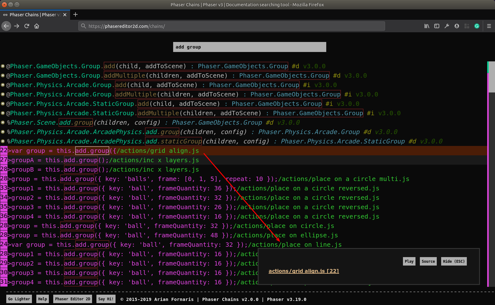

# Phaser Chains

[Phaser Chains](https://phasereditor2d.com/chains) is a tool to browse the Phaser API and examples. It is not the common navigator that presents the data as a tree of elements.

For each Phaser API element we create a line of code (chain) with a particular format, so you will perform a search on all these lines and use the format to extract the information you are looking for.

Let's see an example:

You know the Phaser API allows to write lot of "chaining code", and you can add objects to a scene in this way: `this.add.sprite(...)`. That's ok, but know you want to know all the kind of objects you can add to the scene in the same way, so you write the query:

```
this.add (
```

And the result is:


If you scroll down a bit, you will see a lot of lines extracted from the official Phaser examples:


This means, your query is used to search on the Phaser API and the Phaser examples at the same time. Phaser provides a lot of examples and every major feature is showcased in one or more of them.

If you query for:

```
input add key
```

Then you will get a merge of Phaser API elements and Phaser examples lines.


## The Documentation Panel

If you click on a chain created with the Phaser API, it shows a panel with: 

* The documentation of that API member.
* A toolbar with a to open the source of the selected member.
* and two buttons to navigate on the history of the shown documentation.

The documentation contains links to other API members, so you can get more information quickly.

You can press the `ESC` key to show/hide the panel.


## The Example Panel

When you click on an example line or example file name, it shows a panel with links to the example player and the example source.



## The "mini-map"

Next to the scroll bar there is a kind of mini-map of the chains. There are three different type of chains (API chains, example files, example lines) and each type has a color. The mini-map show a small bar with the chain colors, so you can scroll quickly to the kind of chains you are looking for.


## Matching the chains

The tool provides some "tricks" to help you refine your queries and get more accurate results.

### Wildcards

In many pattern matching tools and APIs there are characters to match a class of characters. For example, the `.` matches any character, the `*` matches with any string of any length, etc... For now, Phaser Chains only uses the `<SPACE>` character to match all strings of any size (like the `*` in other tools).

### Query expansion

Many of the code you write in Phaser starts with `this.<something>`, where `this` is in the context of a `Phaser.Scene` instance. So, to make it more friendly, you can start your queries with the `this.` or `this<SPACE>` prefix, then it is expanded internally to `scene.` or `scene<SPACE>`, to match with all the chains that start with `Phaser.Scene`.

This expansion is applied only when it tests against API chains. When it tests against  the examples the query remains the same.

### Select chains by type

Every chain starts with a special symbol that identifies it. you can use that symbol in your queries to get only chains of a specific type:

* All Phaser API chains start with `@`.
* All example files chains start with `/`.
* All example lines start with `>`.

### Select chains by version

Every API chain ends with the version of the API member. You can write a query to get the API introduced in a specific version by using the version number. For example, this query shows all the `Phaser.LoaderPlugin` members introduced in Phaser v3.17:

```
this.load v3.1
```

## Issues

Please, file issues here, in this project.

## Contact Us

Twitter: [@PhaserEditor2D](https://twitter.com/PhaserEditor2D)

Email: `developers@phasereditor2d.com`

## License

MIT License. Copyright Arian Fornaris.

You are free to use this code in your projects. Credits are not required but is appreciated.

## Phaser Editor 2D

This Phaser Chains thing really helps, but the [Phaser Editor 2D](https://phasereditor2d.com) tooling helps even more, try it :-)


