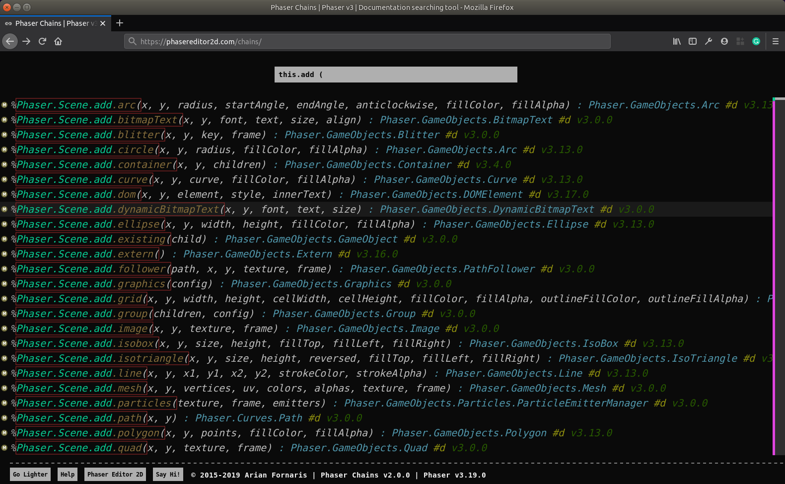
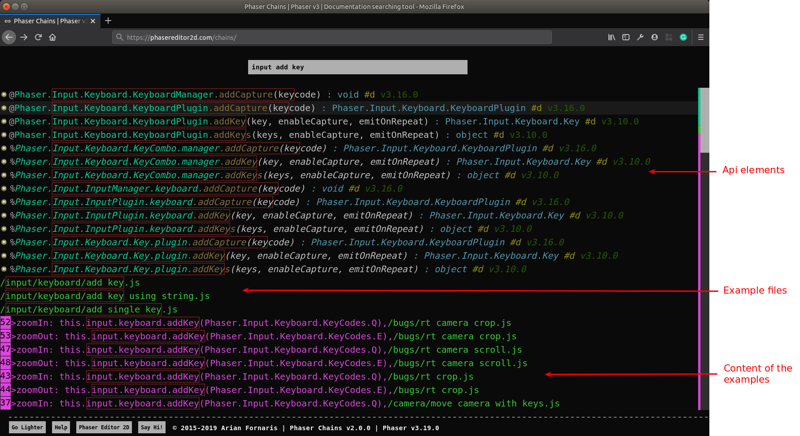

# Phaser Chains

[Phaser Chains](https://chains.phasereditor2d.com/) is a tool to browse the Phaser API and examples. It is not the common navigator that presents the data as a tree of elements.

For each Phaser API element we create a line of code (chain) with a particular pattern, so you will perform a search on all these lines and use the pattern to extract the information you are looking for.

We can say there are two type of API chains, a pure API element, like `Phaser.GameObjects.GameObjectFactory.sprite(..)`, and a "chained" element, like `Phaser.Scene.add.sprite(...)`. Both expressions point to the same API element. Note the chaining element is the "innovation" here, and allows to discover the API quickly.

Let's see an example:

You know you can add objects to a scene in this way: `this.add.sprite(...)`, chaining properties and methods. That's ok, but know you want to know all the kind of objects you can add to the scene in the same way, so you write the query:

```
this.add (
```

And the result is:





If you scroll down a bit, you will see a lot of lines extracted from the official Phaser examples:


This means, your query is used to search on the Phaser API and the Phaser examples at the same time. Phaser provides a lot of examples and every major feature is showcased in one or more of them.

If you query for:

```
input add key
```

Then you will get a merge of Phaser API elements and Phaser examples lines.




## The documentation panel

If you click on a chain created with the Phaser API, it shows a panel with: 

* The documentation of that API element.
* A toolbar with a button to open the source of the selected element.
* And two buttons to navigate on the history of the documentation.

The documentation contains links to other API elements, so you can get more information quickly.

You can press the `ESC` key to show/hide the panel.


## The example panel

When you click on an example line or example file name, it shows a panel with links to the example player and the example source.


## The mini-map

Next to the scroll bar there is a kind of mini-map of the chains. There are three different type of chains (API chains, example files, example lines) and each type has a color. The mini-map show a small bar with the chain colors, so you can scroll quickly to the kind of chains you are looking for.


## Matching the chains

The tool provides some "tricks" to help you refine your queries and get more accurate results.

### Wildcards

In many pattern matching tools and APIs there are characters to match a class of characters. For example, the `.` matches any character, the `*` matches with any string of any length, etc... For now, Phaser Chains only uses the `<SPACE>` character to match all strings of any size (like the `*` in other tools).

### Query expansion

Many of the code you write in Phaser starts with `this.<something>`, where `this` is in the context of a `Phaser.Scene` instance. So, to make it more friendly, you can start your queries with the `this.` or `this<SPACE>` prefix, then it is expanded internally to `scene.` or `scene<SPACE>`, to match with all the chains that start with `Phaser.Scene`.

This expansion is applied only when it tests against API chains. When it tests against  the examples the query remains the same.

### Select chains by type

Every chain starts with a special symbol that identifies it. you can use that symbol in your queries to get only chains of a specific type:

* All Phaser API elements (without chaining, like `Phaser.Loader.LoaderPlugin.image(...)`) start with `@`.
* All chained Phaser API elements (like `Phaser.Scene.load.image(...)`) start with `%`.
* All example file names start with `/`.
* All example content lines start with `>`.

### Select chains by inheritance

At the end of each API chain there is a "tag" to indicate if it is an inherited (`#i`) or declared (`#d`) element.

Query for:

```
sprite.play
```


### Select chains by version

Every API chain ends with the version of the API element. You can write a query to get the API introduced in a specific version by using the version number. For example, this query shows all GameObjects members introduced in Phaser v3.19.0:

```
@ gameobjects #d v3.19.0
```


## Sharing a query

You can share a query using a `query` URL parameter:

```
https://chains.phasereditor2d.com/?query=this.add%20(
```

Note that you have to encode the URL because there are symbols like `#` that can break the query.

You can take a look to this [ASCII Encoding Reference](https://www.w3schools.com/tags/ref_urlencode.asp).

The most common symbols are:

<table>
    <tr>
        <td>space</td><td>%20</td>
    </tr>
    <tr>
        <td>@</td><td>%40</td>
    </tr>
    <tr>
        <td>%</td><td>%25</td>
    </tr>
    <tr>
        <td>/</td><td>%2F</td>
    </tr>
    <tr>
        <td>&gt;</td><td>%3E</td>
    </tr>
    <tr>
        <td>#</td><td>%23</td>
    </tr>
</table>

We should implement a "share query" button in a future release.

## Issues

Please, file issues here, in this project.

## Contact Us

Twitter: [@PhaserEditor2D](https://twitter.com/PhaserEditor2D)

Email: `developers@phasereditor2d.com`

## License

MIT License. Copyright Arian Fornaris.

You are free to use this code in your projects. Credits are not required but is appreciated.

## Phaser Editor 2D

This Phaser Chains thing really helps, but the [Phaser Editor 2D](https://phasereditor2d.com) tooling helps even more, try it :-)


## Change Log

### v2.0.5 - July 15, 2020

* Update Phaser data to Phaser v3.24.1

### v2.0.4 - April 28, 2020

* Update Phaser data to Phaser v3.23.0

### v2.0.3 - November 25, 2019

* Update Phaser data to Phaser v3.21.0

### v2.0.2 - October 16, 2019

* Update Phaser data to Phaser v3.20.1.

### v2.0.1 - August 14, 2019

* Fixed typo in the documentation link.
* Open documentation link in another tab.
* Get new metadata from Phaser Editor 2D, with inherited elements and chaining depth info.
* Chaining API elements start with `%`, and simple API elements with `@`.
* Chaining API elements are painted with an italic font.+
* Chains of API elements ends with `#i` if is inherited or `#d` if it is declared.
* Updated the User Guide, especially the [Matching the chains](#matching-the-chains) section.
